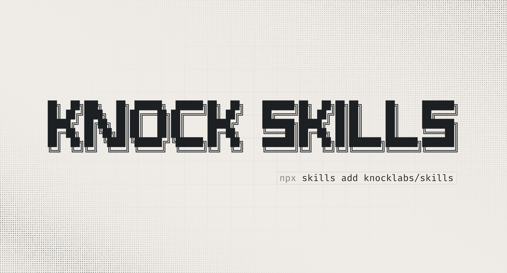

# Knock skills



A collection of skills for AI coding agents working with Knock. Skills are packaged instructions and rules that extend agent capabilities for notification design, copy writing, and Knock CLI workflows.

Skills follow the [Agent Skills](https://agentskills.io/) format.

## Available skills

### notification-best-practices

Comprehensive guidelines for designing, writing, and implementing effective notification systems across all channels (email, push, SMS, in-app, chat).

**Use when:**
- Writing notification copy for any channel
- Designing notification systems or workflows
- Implementing transactional or welcome emails
- Reviewing notification templates for best practices
- Choosing channels and timing for notifications

**Categories covered:**
- Channel-specific guidelines (character limits, structure, tone)
- Copy best practices (specificity, context, active voice)
- System implementation (timing, preferences, error handling, compliance)
- Template examples (signup, payment, collaboration, alerts)
- Transactional email (deliverability, componentized templates, localization)
- Welcome email patterns (founder-led, quick start, value-first)

### template-review

A self-contained reviewer for notification templates across all channels, with a deeper checklist for email. Produces a severity-grouped report (blocker / recommended / nit) and asks before applying fixes.

**Use when:**
- Proofreading or QA-ing a notification template before a send
- Checking subject lines, preheaders, CTAs, and body copy
- Validating variables, conditionals, and links inside a template
- Reviewing email deliverability, accessibility, and dark-mode behavior

**Categories covered:**
- Customizable house style (Oxford commas, casing, emoji policy, reserved terms, forbidden phrases)
- Universal copy editing (typos, grammar, voice, specificity, terminology)
- Channel checks (email, push, SMS, in-app, chat)
- Email deep-dive (headers, structure, links, images, dark mode, accessibility, deliverability, localization, HTML/MJML hygiene)
- Variables, conditionals, and link verification
- Severity-graded output format

### knock-cli

Guidelines for working with the Knock CLI to manage workflows, templates, guides, partials, and other notification resources in a Knock project.

**Use when:**
- Setting up a new Knock project or initializing the CLI
- Pulling or pushing workflows, email layouts, guides, or partials
- Modifying workflow templates (visual blocks vs HTML)
- Working with in-app guides (banners, modals, announcements)
- Creating reusable email partials for design systems
- Managing message types and their schema

**Categories covered:**
- CLI installation and authentication (npm, Homebrew, service tokens)
- Knock directory structure (knock.json, workflows, email-layouts, partials)
- CLI commands reference (pull, push, validate, run)
- Workflow templates (visual blocks, HTML mode, Liquid namespaces)
- Guides and message types (lifecycle messaging vs notifications)
- Partials (reusable blocks, input_schema, visual block editor)

## Installation

### Cursor

```bash
npx skills add knocklabs/skills
```

Or reference skills directly by path when configuring your agent.

### Claude Code

Clone the repository and load it as a plugin:

```bash
git clone https://github.com/knocklabs/skills
claude --plugin-dir ./skills
```

This loads both the skills and the Knock MCP server, giving you access to notification best practices and Knock API tools.

## Usage

Skills are automatically available once installed. The agent will use them when relevant tasks are detected.

**Examples:**
```
Help me write a welcome email for new signups
```
```
Push my workflow changes to Knock
```
```
Review this notification template for best practices
```
```
Create a new partial for our email design system
```

## Skill structure

Each skill contains:
- `SKILL.md` - Human-readable guide and usage instructions (with frontmatter)
- `rules/` - Individual rule files in markdown format

**Exception:** `template-review` intentionally ships as a single `SKILL.md` with no `rules/` directory so it can be pasted into Knock as one self-contained text blob. This is a deliberate portability choice, not an oversight.

## Adding new skills

See `AGENTS.md` for detailed instructions on how to add new skills and rules to this repository.
