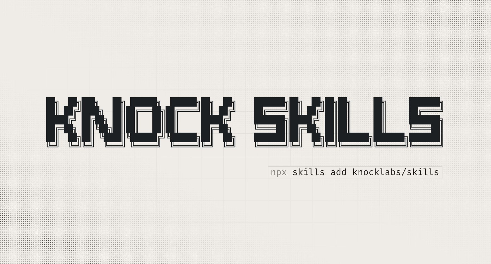

# Knock skills



A collection of skills for AI coding agents working with Knock. Skills are packaged instructions and rules that extend agent capabilities for notification design, copy writing, and Knock CLI workflows.

Skills follow the [Agent Skills](https://agentskills.io/) format.

## Available skills

### knock-setup

Connect Knock to your coding agent, discover and build notification workflows, and recommend how to trigger them from your application.

**Use when:**
- Setting up Knock MCP and skills in Cursor, Codex, or Claude
- Setting up the Knock CLI for CLI-based coding agents
- Discovering high-value notification workflows from a product or codebase
- Building first workflows in Knock via MCP
- Choosing how to trigger workflows (event pipeline, HTTP data source, or API)

**Categories covered:**
- Per-tool connection: MCP for interactive clients, Knock CLI for CLI-based tools
- Workflow discovery and proposals
- Building workflows with Knock MCP
- Implementation approach recommendations
- Wrap-up next steps and dashboard return

### knock-notification-best-practices

Comprehensive guidelines for designing, writing, and implementing effective notification systems across all channels (email, push, SMS, in-app, chat).

**Use when:**
- Writing notification copy for any channel
- Designing notification systems or workflows
- Implementing transactional or welcome emails
- Reviewing notification templates for best practices
- Choosing channels and timing for notifications

**Categories covered:**
- Channel-specific guidelines (character limits, structure, tone)
- Copy best practices (specificity, context, active voice)
- System implementation (timing, preferences, error handling, compliance)
- Template examples (signup, payment, collaboration, alerts)
- Transactional email (deliverability, componentized templates, localization)
- Welcome email patterns (founder-led, quick start, value-first)

### knock-in-app-ui

Guidance for implementing Knock in-app UI in a web app, with a focus on setting up, rendering, and debugging Knock guides in React.

**Use when:**
- Adding Knock guides to a React app for the first time
- Building guide components with `useGuide` / `useGuides`
- Debugging why a guide isn't rendering
- Wiring engagement tracking (seen, interacted, archived)

**Categories covered:**
- Feeds vs. guides product selection (framework-agnostic)
- Provider setup for guides in React (`KnockProvider`, `KnockGuideProvider`)
- Rendering guides with hooks and typed content (React)
- Debugging guides with the toolbar and triage checklist (framework-agnostic)

### knock-cli

Guidelines for working with the Knock CLI to manage workflows, templates, guides, partials, and other notification resources in a Knock project.

**Use when:**
- Setting up a new Knock project or initializing the CLI
- Pulling or pushing workflows, email layouts, guides, or partials
- Modifying workflow templates (visual blocks vs HTML)
- Working with in-app guides (banners, modals, announcements)
- Creating reusable email partials for design systems
- Managing message types and their schema

**Categories covered:**
- CLI installation and authentication (npm, Homebrew, service tokens)
- Knock directory structure (knock.json, workflows, email-layouts, partials)
- CLI commands reference (pull, push, validate, run)
- Workflow templates (visual blocks, HTML mode, Liquid namespaces)
- Guides and message types (lifecycle messaging vs notifications)
- Partials (reusable blocks, input_schema, visual block editor)

### knock-product-messaging-strategy

Design a cross-channel product messaging system that drives activation, engagement, and retention while controlling fatigue. Operationalizes Knock's [product leader messaging manual](https://knock.app/manuals/product-leaders-guide-to-effective-notifications/the-product-leaders-guide-to-effective-notifications). Writes its full plan to a shared `knock-plan.md` file and keeps chat output minimal.

**Use when:**
- Planning lifecycle, onboarding, or retention messaging
- Auditing an existing notification program for gaps and fatigue
- Prioritizing which workflows and guides to build
- Turning product moments into a Knock-ready messaging plan

**Categories covered:**
- Data foundation and meaningful triggers
- Recipient ownership and escalation
- Channel progression, timing, and stop conditions
- Volume controls, batching, and digests
- Personalization and preference taxonomy
- Outcome + fatigue measurement and launch review
- Mapping the plan onto Knock workflows, guides, audiences, and preferences

### knock-migrate-to-knock

Investigate existing messaging infrastructure and recommend how it maps to Knock. Links Braze/Courier and core concept docs. Discovery and planning only unless the user explicitly asks to write Knock resources. Writes its inventory and phased plan to a shared `knock-plan.md` file and keeps chat output minimal.

**Use when:**
- Migrating from Braze, Courier, Customer.io, Iterable, or a custom/ESP stack
- Planning a phased cutover to Knock

**Categories covered:**
- Codebase inventory of providers, templates, and send call sites
- Platform concept mapping (campaigns, lists, topics, brands → Knock)
- Resource migration order and phased cutover plan

### knock-lifecycle-opportunities

Scan product code for activation, engagement, expansion, and churn signals; recommend precise lifecycle messaging opportunities. Does not modify Knock resources. Writes its opportunity briefs to a shared `knock-plan.md` file and keeps chat output minimal.

**Use when:**
- Finding onboarding, trial, invite, or win-back candidates from the codebase

**Categories covered:**
- Lifecycle signal mapping in code (signup, activation, billing, churn)
- Opportunity prioritization by growth impact
- Opportunity brief format and setup handoff

## Installation

### Plugins (recommended)

Install skills + the Knock MCP server across supported agents:

```bash
npx plugins add knocklabs/skills
```

Works with Cursor, Claude Code, Codex, Grok Build, and other Agent Plugins clients. MCP OAuth opens on first Knock tool use against `https://mcp.knock.app/mcp`.

Management API code mode tools:

- `search_mapi` — explore the Management API OpenAPI spec
- `execute_mapi_read` — GET requests
- `execute_mapi_write` — POST / PUT / PATCH / DELETE (requires Manage consent)

### Skills-only

```bash
npx skills add knocklabs/skills
```

### Claude Code (local plugin dir)

```bash
git clone https://github.com/knocklabs/skills
claude --plugin-dir ./skills
```

This loads both the skills and the Knock MCP server from `.mcp.json`.

## Usage

Skills are automatically available once installed. The agent will use them when relevant tasks are detected.

**Examples:**
```
Help me write a welcome email for new signups
```
```
Push my workflow changes to Knock
```
```
Review this notification template for best practices
```
```
Create a new partial for our email design system
```
```
Add Knock guides to my React app
```

## Skill structure

Each skill contains:
- `SKILL.md` - Human-readable guide and usage instructions (with frontmatter)
- `rules/` - Individual rule files in markdown format

## Adding new skills

See `AGENTS.md` for detailed instructions on how to add new skills and rules to this repository.
